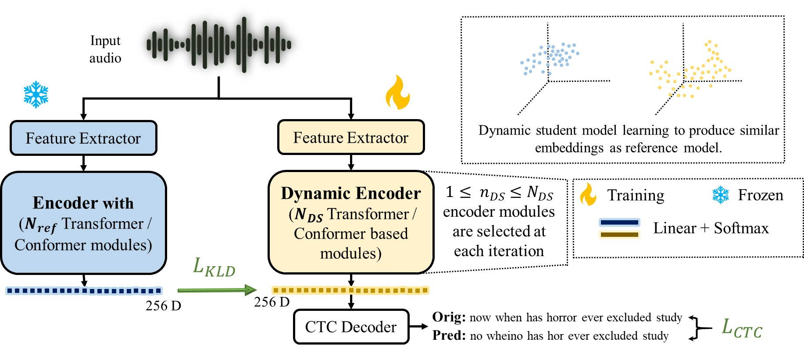

# Distillation-based Layer Dropping (DLD): Effective End-to-end Framework for Dynamic Speech Networks

Paper Link: [arxiv][] &nbsp; [ICASSP][]

## Code
Coming soon.!!

## Overview
Large Speech Models (LSMs) are effective in transcribing audio data while offering high computational complexity and lacking scalability for different computational budgets. To effectively leverage the capabilities of a LSMs for different computational budgets, methods like early exit, adaptive pruning, and layer dropping are used. 

DLD is an end-to-end framework for Automatic Speech Recongition (ASR) that performs knowledge distillation from the teacher network to the dynamic / scalable child network, thus, minimizing the difference between models embeddings and optimizing the performance on all computational budgets.

## Architecture

